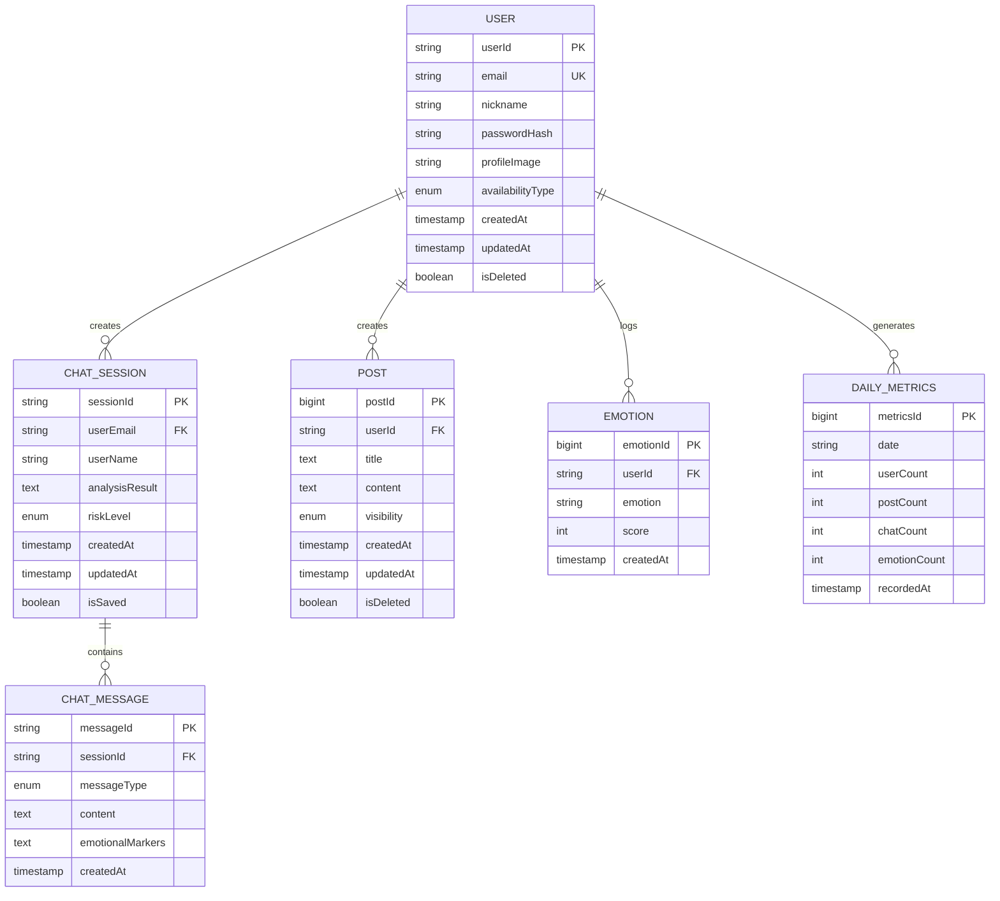

```mermaid
erDiagram
    USER ||--o{ CHAT_SESSION : creates
    USER ||--o{ POST : creates
    USER ||--o{ EMOTION : logs
    CHAT_SESSION ||--o{ CHAT_MESSAGE : contains
    USER ||--o{ DAILY_METRICS : generates
    
    USER {
        string userId PK
        string email UK
        string nickname
        string passwordHash
        string profileImage
        enum availabilityType
        timestamp createdAt
        timestamp updatedAt
        boolean isDeleted
    }
    
    CHAT_SESSION {
        string sessionId PK
        string userEmail FK
        string userName
        text analysisResult
        enum riskLevel
        timestamp createdAt
        timestamp updatedAt
        boolean isSaved
    }
    
    CHAT_MESSAGE {
        string messageId PK
        string sessionId FK
        enum messageType
        text content
        text emotionalMarkers
        timestamp createdAt
    }
    
    POST {
        bigint postId PK
        string userId FK
        text title
        text content
        enum visibility
        timestamp createdAt
        timestamp updatedAt
        boolean isDeleted
    }
    
    EMOTION {
        bigint emotionId PK
        string userId FK
        string emotion
        int score
        timestamp createdAt
    }
    
    DAILY_METRICS {
        bigint metricsId PK
        string date
        int userCount
        int postCount
        int chatCount
        int emotionCount
        timestamp recordedAt
    }
```