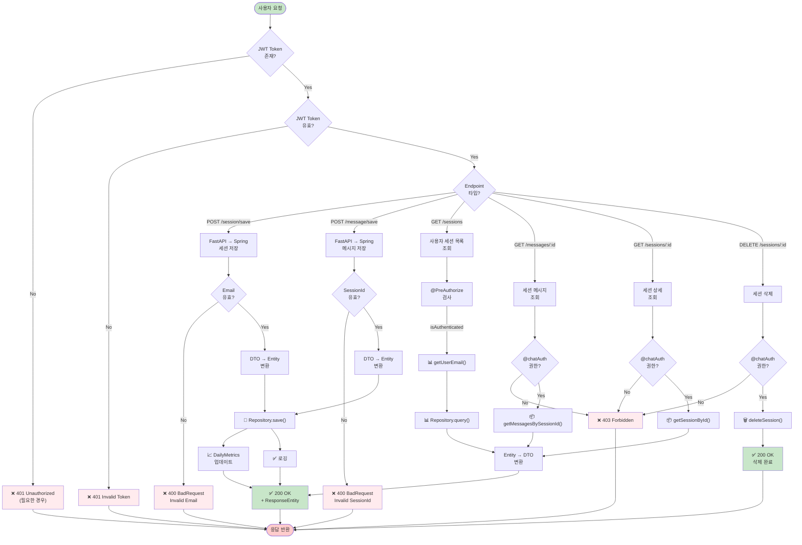
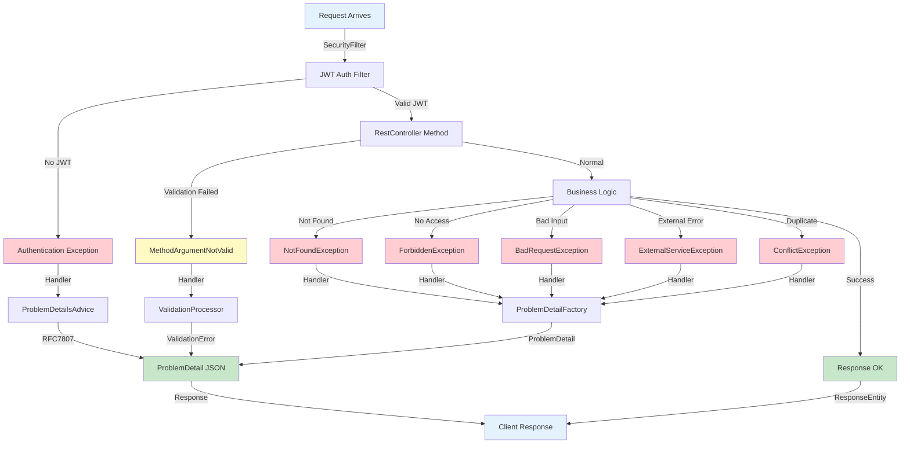

## 채팅 세션 CRUD

```mermaid
flowchart TD
Start([사용자 요청]) --> CheckAuth{JWT Token<br/>존재?}

    CheckAuth -->|No| Unauth["❌ 401 Unauthorized<br/>(필요한 경우)"]
    CheckAuth -->|Yes| ValidateToken{JWT Token<br/>유효?}
    
    ValidateToken -->|No| InvalidToken["❌ 401 Invalid Token"]
    ValidateToken -->|Yes| CheckEndpoint{Endpoint<br/>타입?}
    
    CheckEndpoint -->|POST /session/save| SaveSession["FastAPI → Spring<br/>세션 저장"]
    CheckEndpoint -->|POST /message/save| SaveMessage["FastAPI → Spring<br/>메시지 저장"]
    CheckEndpoint -->|GET /sessions| ListSessions["사용자 세션 목록<br/>조회"]
    CheckEndpoint -->|GET /messages/:id| GetMessages["세션 메시지<br/>조회"]
    CheckEndpoint -->|GET /sessions/:id| GetSession["세션 상세<br/>조회"]
    CheckEndpoint -->|DELETE /sessions/:id| DeleteSession["세션 삭제"]
    
    SaveSession --> ValidateEmail{Email<br/>유효?}
    SaveMessage --> ValidateSessionId{SessionId<br/>유효?}
    ListSessions --> RequireAuth["@PreAuthorize<br/>검사"]
    GetMessages --> CheckAccess{"@chatAuth<br/>권한?"}
    GetSession --> CheckAccess2{"@chatAuth<br/>권한?"}
    DeleteSession --> CheckAccess3{"@chatAuth<br/>권한?"}
    
    ValidateEmail -->|No| ErrorEmail["❌ 400 BadRequest<br/>Invalid Email"]
    ValidateEmail -->|Yes| MapToEntity["DTO → Entity<br/>변환"]
    
    ValidateSessionId -->|No| ErrorSession["❌ 400 BadRequest<br/>Invalid SessionId"]
    ValidateSessionId -->|Yes| MapToEntity2["DTO → Entity<br/>변환"]
    
    RequireAuth -->|isAuthenticated| QueryDB["📊 getUserEmail()"]
    
    CheckAccess -->|No| ForbiddenAccess["❌ 403 Forbidden"]
    CheckAccess -->|Yes| QueryMessages["📦 getMessagesBySessionId()"]
    
    CheckAccess2 -->|No| ForbiddenAccess
    CheckAccess2 -->|Yes| QuerySession["📦 getSessionById()"]
    
    CheckAccess3 -->|No| ForbiddenAccess
    CheckAccess3 -->|Yes| DeleteOp["🗑️ deleteSession()"]
    
    MapToEntity --> SaveDB["💾 Repository.save()"]
    MapToEntity2 --> SaveDB
    QueryDB --> QueryDB2["📊 Repository.query()"]
    
    QueryMessages --> MapperDTO["Entity → DTO<br/>변환"]
    QuerySession --> MapperDTO
    
    SaveDB --> Metrics["📈 DailyMetrics<br/>업데이트"]
    SaveDB --> LogSuccess["✅ 로깅"]
    
    QueryDB2 --> MapperDTO
    Metrics --> Success["✅ 200 OK<br/>+ ResponseEntity"]
    LogSuccess --> Success
    MapperDTO --> Success
    DeleteOp --> SuccessDelete["✅ 200 OK<br/>삭제 완료"]
    
    Success --> End([응답 반환])
    SuccessDelete --> End
    ErrorEmail --> End
    ErrorSession --> End
    ForbiddenAccess --> End
    Unauth --> End
    InvalidToken --> End
    
    style Start fill:#c8e6c9
    style End fill:#ffcccc
    style Unauth fill:#ffebee
    style InvalidToken fill:#ffebee
    style ErrorEmail fill:#ffebee
    style ErrorSession fill:#ffebee
    style ForbiddenAccess fill:#ffebee
    style Success fill:#c8e6c9
    style SuccessDelete fill:#c8e6c9
```

## 에러 처리 흐름

```mermaid
flowchart TD
    Start["Request Arrives"]
    
    Start -->|SecurityFilter| Filter["JWT Auth Filter"]
    
    Filter -->|Valid JWT| Controller["RestController Method"]
    Filter -->|No JWT| SecurityErr["Authentication Exception"]
    
    Controller -->|Normal| Service["Business Logic"]
    Controller -->|Validation Failed| ValidationErr["MethodArgumentNotValid"]
    
    Service -->|Success| Return["Response OK"]
    Service -->|Not Found| NotFoundErr["NotFoundException"]
    Service -->|No Access| ForbiddenErr["ForbiddenException"]
    Service -->|Bad Input| BadReqErr["BadRequestException"]
    Service -->|External Error| ExtErr["ExternalServiceException"]
    Service -->|Duplicate| ConflictErr["ConflictException"]
    
    SecurityErr -->|Handler| AdviceHandle1["ProblemDetailsAdvice"]
    ValidationErr -->|Handler| AdviceHandle2["ValidationProcessor"]
    NotFoundErr -->|Handler| AdviceHandle3["ProblemDetailFactory"]
    ForbiddenErr -->|Handler| AdviceHandle3
    BadReqErr -->|Handler| AdviceHandle3
    ExtErr -->|Handler| AdviceHandle3
    ConflictErr -->|Handler| AdviceHandle3
    
    AdviceHandle1 -->|RFC7807| ProblemDetail["ProblemDetail JSON"]
    AdviceHandle2 -->|ValidationError| ProblemDetail
    AdviceHandle3 -->|ProblemDetail| ProblemDetail
    
    ProblemDetail -->|Response| Client["Client Response"]
    Return -->|ResponseEntity| Client
    
    style Start fill:#e3f2fd
    style Client fill:#e3f2fd
    style SecurityErr fill:#ffcdd2
    style ValidationErr fill:#fff9c4
    style NotFoundErr fill:#ffcdd2
    style ForbiddenErr fill:#ffcdd2
    style BadReqErr fill:#ffcdd2
    style ExtErr fill:#ffcdd2
    style ConflictErr fill:#ffcdd2
    style ProblemDetail fill:#c8e6c9
    style Return fill:#c8e6c9
```
