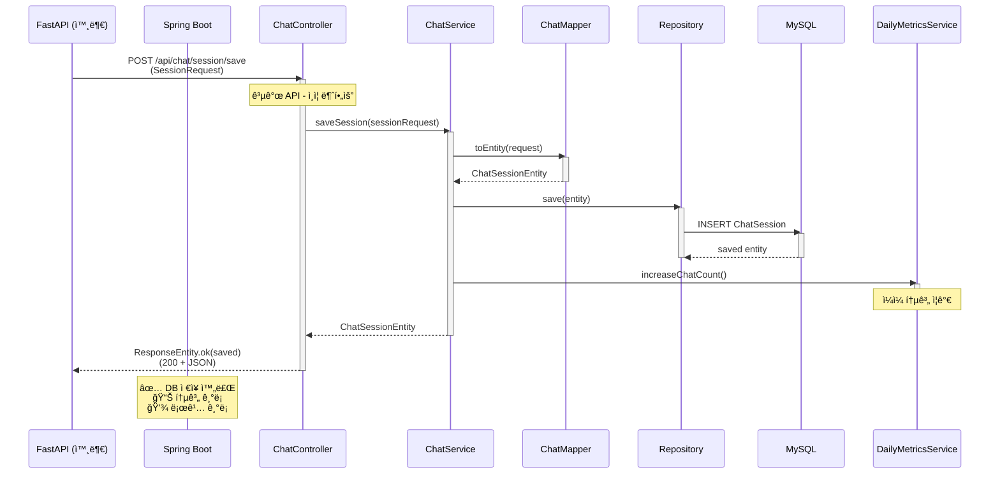
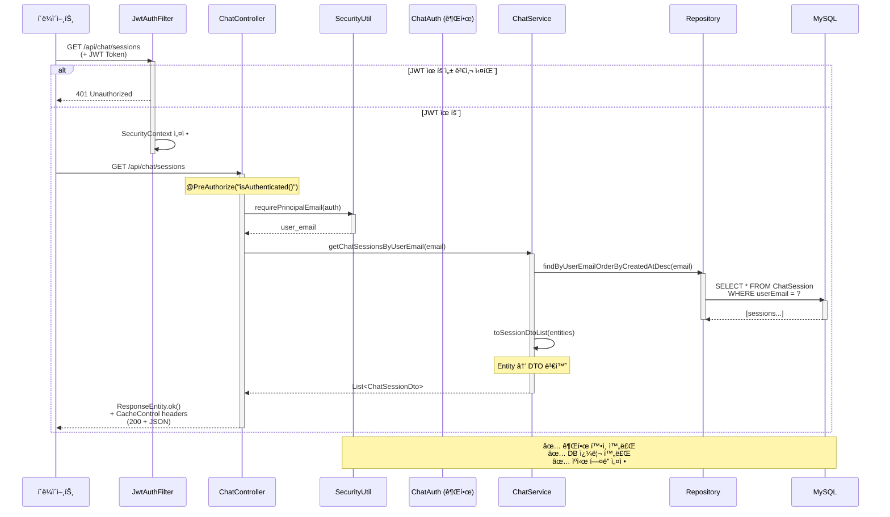
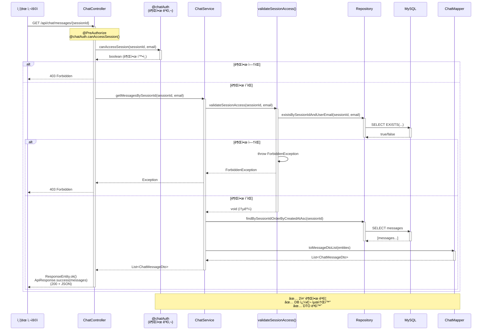

## 채팅 세션 ì €ì¥ ì‹œí€€ìŠ¤

```mermaid
sequenceDiagram
participant FastAPI as FastAPI (외부)
participant Spring as Spring Boot
participant Controller as ChatController
participant Service as ChatService
participant Mapper as ChatMapper
participant Repo as Repository
participant DB as MySQL
participant Metrics as DailyMetricsService

    FastAPI->>Controller: POST /api/chat/session/save<br/>(SessionRequest)
    activate Controller
    Note over Controller: 공개 API - ì¸ì¦ 불필요
    
    Controller->>Service: saveSession(sessionRequest)
    activate Service
    
    Service->>Mapper: toEntity(request)
    activate Mapper
    Mapper-->>Service: ChatSessionEntity
    deactivate Mapper
    
    Service->>Repo: save(entity)
    activate Repo
    Repo->>DB: INSERT ChatSession
    activate DB
    DB-->>Repo: saved entity
    deactivate DB
    deactivate Repo
    
    Service->>Metrics: increaseChatCount()
    activate Metrics
    Note over Metrics: ì¼ì¼ 통계 ì¦ê°€
    deactivate Metrics
    
    Service-->>Controller: ChatSessionEntity
    deactivate Service
    
    Controller-->>FastAPI: ResponseEntity.ok(saved)<br/>(200 + JSON)
    deactivate Controller
    
    Note over Spring: ✅ DB ì €ì¥ ì™„ë£Œ<br/>📊 통계 기ë¡<br/>💾 로깅 기ë¡
```

## 사용ì 채팅 세션 조회 시퀀스

```mermaid
sequenceDiagram
    participant Client as í´ë¼ì´ì–¸íŠ¸
    participant Filter as JwtAuthFilter
    participant Controller as ChatController
    participant SecurityUtil as SecurityUtil
    participant ChatAuth as ChatAuth (권한)
    participant Service as ChatService
    participant Repo as Repository
    participant DB as MySQL
    
    Client->>Filter: GET /api/chat/sessions<br/>(+ JWT Token)
    activate Filter
    
    alt JWT 유효성 검사 실패
        Filter-->>Client: 401 Unauthorized
    else JWT 유효
        Filter->>Filter: SecurityContext 설정
        deactivate Filter
        
        Client->>Controller: GET /api/chat/sessions
        activate Controller
        
        Note over Controller: @PreAuthorize("isAuthenticated()")
        
        Controller->>SecurityUtil: requirePrincipalEmail(auth)
        activate SecurityUtil
        SecurityUtil-->>Controller: user_email
        deactivate SecurityUtil
        
        Controller->>Service: getChatSessionsByUserEmail(email)
        activate Service
        
        Service->>Repo: findByUserEmailOrderByCreatedAtDesc(email)
        activate Repo
        
        Repo->>DB: SELECT * FROM ChatSession<br/>WHERE userEmail = ?
        activate DB
        DB-->>Repo: [sessions...]
        deactivate DB
        deactivate Repo
        
        Service->>Service: toSessionDtoList(entities)
        Note over Service: Entity → DTO 변환
        
        Service-->>Controller: List<ChatSessionDto>
        deactivate Service
        
        Controller-->>Client: ResponseEntity.ok()<br/>+ CacheControl headers<br/>(200 + JSON)
        deactivate Controller
    end
    
    Note over SecurityUtil,DB: ✅ 권한 í™•ì¸ ì™„ë£Œ<br/>✅ DB 쿼리 완료<br/>✅ ìºì‹œ í—¤ë” ì„¤ì •
```

## 메시지 조회 시퀀스

```mermaid
sequenceDiagram
    participant User as ì¸ì¦ëœ 사용ì
    participant Controller as ChatController
    participant ChatAuth as @chatAuth<br/>(권한 검사)
    participant Service as ChatService
    participant Validator as validateSessionAccess()
    participant Repo as Repository
    participant DB as MySQL
    participant Mapper as ChatMapper
    
    User->>Controller: GET /api/chat/messages/{sessionId}
    activate Controller
    
    Note over Controller: @PreAuthorize<br/>@chatAuth.canAccessSession()
    
    Controller->>ChatAuth: canAccessSession(sessionId, email)
    activate ChatAuth
    ChatAuth-->>Controller: boolean (권한 확ì¸)
    deactivate ChatAuth
    
    alt 권한 ì—†ìŒ
        Controller-->>User: 403 Forbidden
    else 권한 ìˆìŒ
        Controller->>Service: getMessagesBySessionId(sessionId, email)
        activate Service
        
        Service->>Validator: validateSessionAccess(sessionId, email)
        activate Validator
        
        Validator->>Repo: existsBySessionIdAndUserEmail(sessionId, email)
        activate Repo
        Repo->>DB: SELECT EXISTS(...) 
        activate DB
        DB-->>Repo: true/false
        deactivate DB
        deactivate Repo
        
        alt 권한 ì—†ìŒ
            Validator->>Validator: throw ForbiddenException
            Validator-->>Service: ForbiddenException
            Service-->>Controller: Exception
            Controller-->>User: 403 Forbidden
        else 권한 ìˆìŒ
            Validator-->>Service: void (통과)
            deactivate Validator
            
            Service->>Repo: findBySessionIdOrderByCreatedAtAsc(sessionId)
            activate Repo
            Repo->>DB: SELECT messages
            activate DB
            DB-->>Repo: [messages...]
            deactivate DB
            deactivate Repo
            
            Service->>Mapper: toMessageDtoList(entities)
            activate Mapper
            Mapper-->>Service: List<ChatMessageDto>
            deactivate Mapper
            
            Service-->>Controller: List<ChatMessageDto>
            deactivate Service
            
            Controller-->>User: ResponseEntity.ok()<br/>ApiResponse.success(messages)<br/>(200 + JSON)
            deactivate Controller
        end
    end
    
    Note over ChatAuth,Mapper: ✅ 2중 권한 ê²€ì¦<br/>✅ DB 쿼리 최소화<br/>✅ DTO 변환
```
