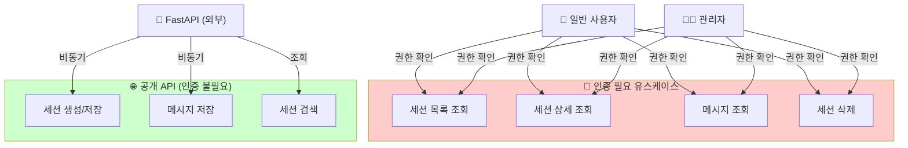

```mermaid
graph TB
    User["👤 일반 사용자"]
    FastAPI["🤖 FastAPI (외부)"]
    Admin["👨‍💼 관리자"]
    
    subgraph 인증필요["🔐 인증 필요 유스케이스"]
        U1["세션 목록 조회"]
        U2["세션 상세 조회"]
        U3["메시지 조회"]
        U4["세션 삭제"]
    end
    
    subgraph 공개API["🌐 공개 API (인증 불필요)"]
        U5["세션 생성/저장"]
        U6["메시지 저장"]
        U7["세션 검색"]
    end
    
    User -->|권한 확인| U1
    User -->|권한 확인| U2
    User -->|권한 확인| U3
    User -->|권한 확인| U4
    
    FastAPI -->|비동기| U5
    FastAPI -->|비동기| U6
    FastAPI -->|조회| U7
    
    Admin -->|권한 확인| U1
    Admin -->|권한 확인| U2
    Admin -->|권한 확인| U3
    Admin -->|권한 확인| U4
    
    style 인증필요 fill:#ffcccc
    style 공개API fill:#ccffcc
```