## 사용자, 관리자, FastAPI 유스케이스

```mermaid
graph TB
    User["👤 일반 사용자"]
    FastAPI["🤖 FastAPI (외부)"]
    Admin["👨‍💼 관리자"]
    
    subgraph 인증필요["🔐 인증 필요 유스케이스"]
        U1["세션 목록 조회"]
        U2["세션 상세 조회"]
        U3["메시지 조회"]
        U4["세션 삭제"]
    end
    
    subgraph 공개API["🌐 공개 API (인증 불필요)"]
        U5["세션 생성/저장"]
        U6["메시지 저장"]
        U7["세션 검색"]
    end
    
    User -->|권한 확인| U1
    User -->|권한 확인| U2
    User -->|권한 확인| U3
    User -->|권한 확인| U4
    
    FastAPI -->|비동기| U5
    FastAPI -->|비동기| U6
    FastAPI -->|조회| U7
    
    Admin -->|권한 확인| U1
    Admin -->|권한 확인| U2
    Admin -->|권한 확인| U3
    Admin -->|권한 확인| U4
    
    style 인증필요 fill:#ffcccc
    style 공개API fill:#ccffcc
```

## 전체 시스템 아키텍처 흐름

```mermaid
graph LR
    subgraph Client["🖥️ 클라이언트 (Web/Mobile)"]
        A["사용자 API 요청<br/>(JWT Token)"]
    end
    
    subgraph FastAPI_External["🤖 FastAPI (외부 ML)"]
        B["분석 완료 후<br/>결과 전송"]
    end
    
    subgraph SpringBoot["🔗 Spring Boot Backend"]
        C["JWT Auth Filter<br/>(인증/인가)"]
        D["Controller<br/>(요청 처리)"]
        E["Service<br/>(비즈니스 로직)"]
        F["Repository<br/>(DB 접근)"]
        G["Exception Handler<br/>(ProblemDetail)"]
    end
    
    subgraph Database["💾 데이터베이스"]
        H["MySQL 8.x<br/>(User/Post/Chat/Emotion)"]
    end
    
    subgraph External["🔐 외부 서비스"]
        I["Google/Kakao OAuth"]
        J["OpenAI API"]
    end
    
    A -->|JWT Token + Request| C
    B -->|SessionRequest/MessageRequest| D
    
    C -->|Auth Token 검증| D
    D -->|"@PreAuthorize 검사"| D
    D -->|Call| E
    E -->|Query/Command| F
    F -->|SQL| H
    E -->|Exception| G
    G -->|ProblemDetail JSON| A
    
    A -->|회원가입/로그인| I
    E -->|분석 요청| J
    
    F -->|쿼리 결과| E
    E -->|Response DTO| D
    D -->|ResponseEntity| A
    D -->|ResponseEntity| B
    
    style Client fill:#e1f5ff
    style FastAPI_External fill:#fff3e0
    style SpringBoot fill:#f3e5f5
    style Database fill:#e8f5e9
    style External fill:#fce4ec

```


